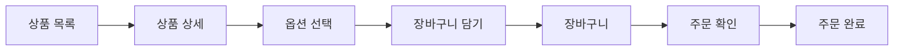

# 카카오 쇼핑하기 React 프로젝트

Kakao Tech Campus Frontend 교육 과정에서 제공된 화면 설계서와 Backend REST API를 바탕으로 상품 탐색부터 장바구니, 주문 완료까지 구현한 프로젝트입니다.

주차별 Pull Request와 mentor code review를 거치며 React의 컴포넌트 책임, 상태 관리, 비동기 데이터 처리 방식을 학습했습니다. 교육 Backend가 종료된 뒤에는 기존 Frontend가 사용한 API 계약을 기준으로 MSW 환경을 구성해 주요 흐름을 다시 실행하고 검증할 수 있도록 정비했습니다.

**React · JavaScript · React Router · Redux Toolkit · TanStack Query · Axios · MSW**


## Project Overview

| 항목 | 내용 |
| --- | --- |
| 교육 과정 | Kakao Tech Campus Frontend |
| 프로젝트 형태 | 주차별 React 과제로 진행한 Frontend 프로젝트 |
| 개발 목적 | 제공된 화면 설계서와 REST API를 이용한 shopping flow 구현 및 React 학습 |
| 구현 범위 | 상품 탐색, 인증, 옵션 선택, 장바구니, 교육용 주문 및 주문 완료 |
| 개발 방식 | 주차별 Pull Request 제출과 mentor code review를 통한 개선 |
| 현재 실행 환경 | 종료된 교육 Backend를 대신하는 stateful MSW Mock API |

## Core User Flow



핵심 구매 흐름은 상품 상세에서 옵션을 선택해 장바구니에 담은 뒤, 장바구니 전체를 확인하고 교육용 주문을 생성하는 과정입니다.

## Key Features

### Product Discovery

- 상품 목록과 가격·할인·배송 정보 표시
- URL query string을 이용한 검색과 category filter
- `useInfiniteQuery`와 Intersection Observer를 이용한 page 단위 추가 조회
- 최초 loading, 추가 loading, 빈 결과, 마지막 page, request error 상태 구분

### Product Detail

- URL의 상품 ID를 이용한 상세 정보 조회
- option 선택과 중복 선택 방지
- option별 수량 변경과 최소·최대 수량 제한
- 선택 option의 합계 계산 및 장바구니 추가

### Authentication

- login, signup, logout과 form validation
- Redux Toolkit으로 애플리케이션 인증 상태 관리
- localStorage를 이용한 새로고침 후 token 복원
- `RequiredAuthLayout`을 이용한 cart·order route 보호

### Cart & Order

- cart 조회, option별 수량 변경과 삭제, 총액 계산
- cart option별 수량 변경과 실패 시 이전 수량 복구
- 필수 동의 완료 후 교육용 주문 생성
- 주문 ID를 이용한 주문 완료 결과 조회

## Tech Stack

| Category | Technology | Role |
| --- | --- | --- |
| UI | React 18.2, JavaScript | Component 기반 화면 및 interaction 구현 |
| Routing | React Router 6 | 화면 전환, URL parameter, protected route |
| Client State | Redux Toolkit 1.9.5 | 인증 상태 공유 |
| Server State | TanStack React Query 4.32 | Query, mutation, cache lifecycle 관리 |
| HTTP | Axios | 공통 instance, timeout, Authorization header |
| Mock API | MSW 2.15 | 종료된 교육 Backend의 주요 API 흐름 재현 |
| Styling | Tailwind CSS 3, styled-components 6, CSS | 화면 layout과 component styling |
| Test | Jest, React Testing Library | 사용자 interaction과 API contract 회귀 검증 |
| Build | Create React App 5 | 개발 서버와 production build |

## Implementation & Learning

### Component Responsibility

Atomic Design의 component 계층 개념을 참고해 `atoms`, `molecules`, `organisms`, `templates`, `pages`로 화면을 나눴습니다. 명칭 자체보다 state와 event를 어느 component가 소유해야 하는지에 초점을 맞추고, 입력·수량·오류 UI처럼 반복되는 책임을 component와 hook, utility로 분리했습니다.

### Client State와 Server State 분리

여러 화면이 함께 사용하는 인증 상태는 Redux Toolkit으로 관리하고, 상품·cart·order처럼 API에서 조회하는 데이터는 React Query가 담당하도록 구분했습니다. localStorage는 인증 상태 자체를 대체하지 않고 새로고침 후 token을 복원하는 persistent storage로 사용했습니다.

### Infinite Query와 화면 상태

상품 목록을 page 단위로 누적하고 observer가 하단에 진입했을 때 다음 page를 요청했습니다. 최초 loading과 추가 loading을 나누고, 검색·category filter 중에는 필요한 page를 조회한 뒤 client filtering을 적용하도록 구성했습니다.

### Form과 Validation

login과 signup의 입력 상태를 `useInput`으로 공통화하고, email·password·name·password confirmation 검증은 순수 utility로 분리했습니다. button click과 Enter submit이 동일한 form 흐름을 거치며, 중복 submit과 API error도 화면 상태로 처리합니다.

## Code Review & Growth

교육 과정에서는 기능 구현 후 Pull Request를 제출하고, 리뷰에서 받은 질문과 제안을 후속 학습과 구현에 반영했습니다. 아래 사례는 실제 교육 PR에서 확인한 학습 과정입니다.

### 1. Form State & Validation — [PR #71](https://github.com/Kakao-tech-campus-FE/step2-FE-kakao-shop/pull/71)

- **Before:** `RegisterForm`에 입력값과 validation, error state 책임이 집중되어 있었습니다.
- **Review:** 관련 입력 상태는 Custom Hook으로 묶고, 재사용 가능한 validation은 utility로 분리할 수 있다는 피드백을 받았습니다.
- **Improvement:** 후속 구현에서 공통 입력 처리를 `useInput`으로, 검증 규칙을 validation utility로 분리했습니다.
- **Learning:** form을 동작시키는 데서 그치지 않고 component state와 순수 검증 로직의 책임을 구분했습니다.

### 2. Authentication State Responsibility — [PR #71](https://github.com/Kakao-tech-campus-FE/step2-FE-kakao-shop/pull/71)

- **Before:** 로그인 상태가 `App` local state, localStorage, component props에 분산되어 있었습니다.
- **Review:** 인증 상태를 전역에서 관리하고 Redux state를 UI 판단의 중심으로 활용하는 방향을 제안받았습니다.
- **Improvement:** Redux Toolkit으로 인증 상태를 공유하고 localStorage는 새로고침 후 token 복원에 사용했습니다.
- **Learning:** 화면 상태와 persistent storage의 역할을 구분하고 인증 상태의 소유자를 명확히 했습니다.

### 3. React Query Cache Identity — [PR #197](https://github.com/Kakao-tech-campus-FE/step2-FE-kakao-shop/pull/197)

- **Before:** 상품 상세 query에 고정된 `product` key를 사용했습니다.
- **Review:** 상품 ID를 query key에 포함해 cache identity를 구분해야 한다는 피드백을 받았습니다.
- **Improvement:** 후속 구현과 포트폴리오 정비를 거쳐 domain별 query key를 정의하고 상품·주문 ID를 key에 포함했습니다.
- **Learning:** Query Key가 단순 이름이 아니라 server-state cache의 식별자라는 점을 이해했습니다.

## Portfolio Refactoring — 종료된 교육 환경 복원

포트폴리오 정비의 목적은 기능 확장이 아니라, 종료된 교육 환경에서도 기존 프로젝트를 실행하고 검증할 수 있게 복원하는 것이었습니다.

### 실행 환경 복원

교육 Backend를 더 이상 사용할 수 없어 상품, 인증, cart, order의 주요 API 흐름을 stateful MSW Mock으로 재현했습니다. Component가 Mock 전용 코드를 직접 호출하지 않고 기존 `React Query → service → Axios` 경계를 통과하면 MSW가 network request를 intercept합니다.

### 교육 API 계약 보존

공식 Backend 명세가 repository에 남아 있지 않아 교육 마지막 baseline의 Frontend 사용 방식을 근거로 endpoint, method, request와 response dependency를 다시 확인했습니다. 대표적으로 Mock 환경에서 확장됐던 `POST /api/orders/save`의 `{ cartIds }` request를 제거하고 교육 baseline의 `null` body로 복원했습니다.

Mock에 맞춘 기능 확장보다 당시 Frontend가 실제 사용한 계약과 전체 cart 주문 흐름을 보존하는 것을 우선했습니다.

### 핵심 흐름 안정화

- Protected query의 `401` 인증 복구와 cart item별 mutation lock 적용
- 상품 image fallback과 주문 동의 button의 실제 `disabled` 상태 보완
- API contract 회귀 테스트와 desktop/mobile browser smoke로 핵심 흐름 재검증

## Testing

단순 rendering 수치보다 사용자 interaction과 API 계약의 회귀 방지에 초점을 맞췄습니다.

- login·signup validation과 submit
- protected query `401`의 인증 복구
- cart optimistic update, rollback, item별 mutation lock
- 주문 필수 동의와 중복 submit 방지
- `POST /api/orders/save`의 original `null` request contract
- MSW cart·order state 및 주문 완료 조회
- 상품 image fallback

```text
18 test suites passed
72 tests passed
Production build passed
```

## Screens

### Product Detail

상품 정보와 option 선택, 수량, 합계를 한 화면에서 확인하고 선택한 option을 cart에 추가합니다.


### Cart

cart에 담긴 상품과 option을 확인하고 수량 변경, 삭제, 합계 계산 후 주문 화면으로 이동합니다.


### Order

현재 cart 전체와 예시 배송 정보, 결제수단, 필수 동의를 확인합니다. 실제 결제는 발생하지 않습니다.


### Order Complete

주문 API가 반환한 ID로 주문 결과를 조회하고 상품 option과 총 주문 금액을 표시합니다.


## Key Pull Requests

| Stage | PR | Main Topic |
| --- | --- | --- |
| Week 1 | [#62](https://github.com/Kakao-tech-campus-FE/step2-FE-kakao-shop/pull/62) | 기본 component 구조와 화면 구성 |
| Week 2 | [#71](https://github.com/Kakao-tech-campus-FE/step2-FE-kakao-shop/pull/71) | 인증, Redux, form state와 validation |
| Week 3 | [#136](https://github.com/Kakao-tech-campus-FE/step2-FE-kakao-shop/pull/136) | 상품 목록, React Query, loading·error UI |
| Week 4 | [#197](https://github.com/Kakao-tech-campus-FE/step2-FE-kakao-shop/pull/197) | 상품 상세, query key, option 처리 |
| Week 5 | [#269](https://github.com/Kakao-tech-campus-FE/step2-FE-kakao-shop/pull/269) | cart, order, order complete |

## Running Locally

- Node.js `>=22.20.0 <23`
- npm `>=10 <11`

### Install and Run

```bash
npm ci
npm start
```

브라우저에서 `http://localhost:3000`으로 접속합니다. 별도의 Backend나 환경변수 설정 없이 MSW가 기본 실행되며 `/api` request를 browser network layer에서 intercept합니다.

테스트와 production build는 다음 명령으로 확인할 수 있습니다.

```bash
npm test -- --watchAll=false
npm run build
```

## Known Limitations

- Product Detail의 `구매하기` 버튼은 교육 baseline을 보존한 alert-only 동작이며 실제 Buy Now flow가 아닙니다.
- 주문 과정은 실제 결제가 발생하지 않는 교육용 flow입니다.
- 현재 실행 환경은 종료된 교육 Backend를 대신하는 stateful MSW Mock이며, 새로고침하면 cart·order demo state가 초기화될 수 있습니다.
