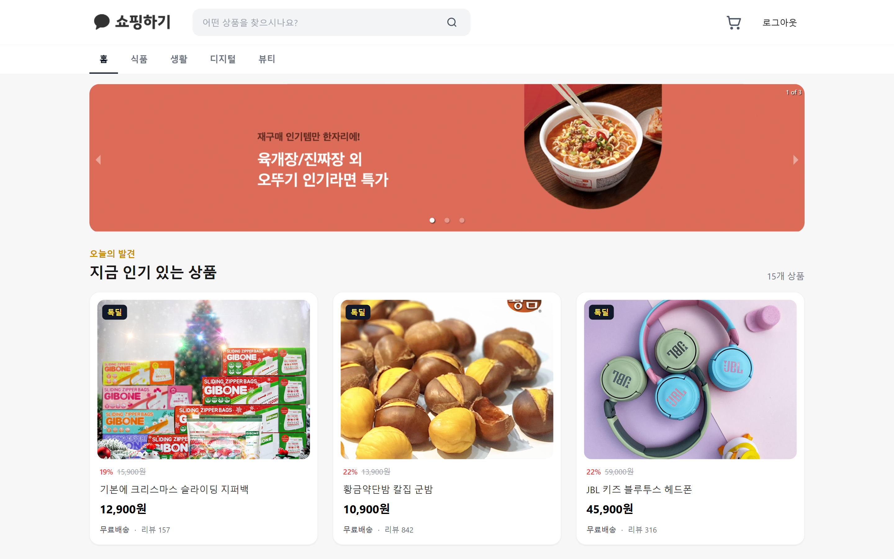
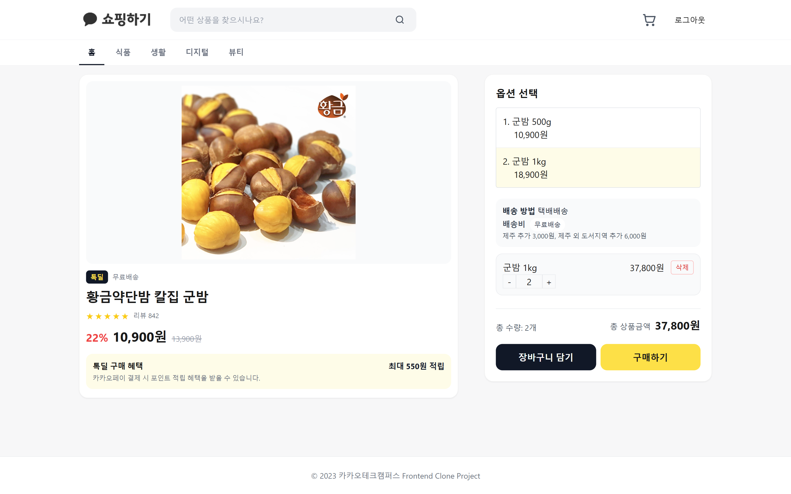
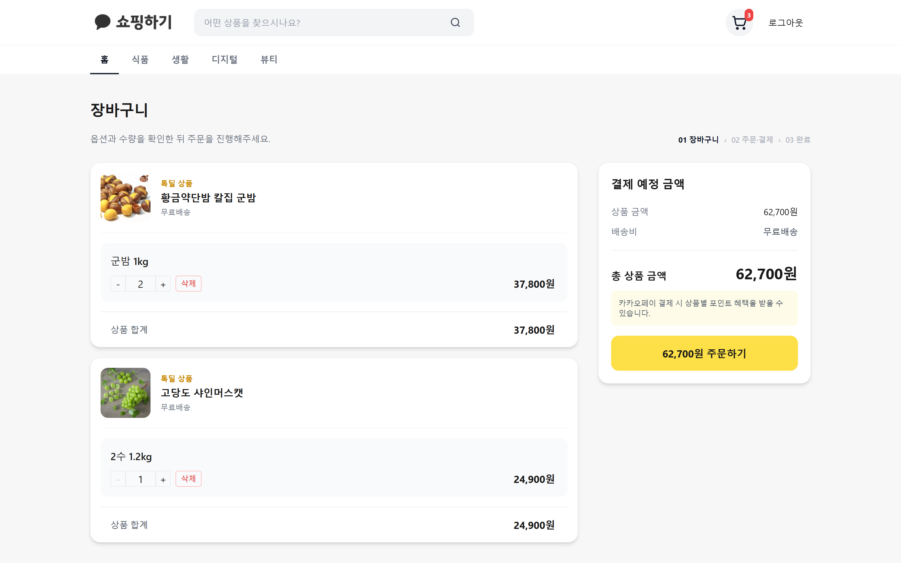
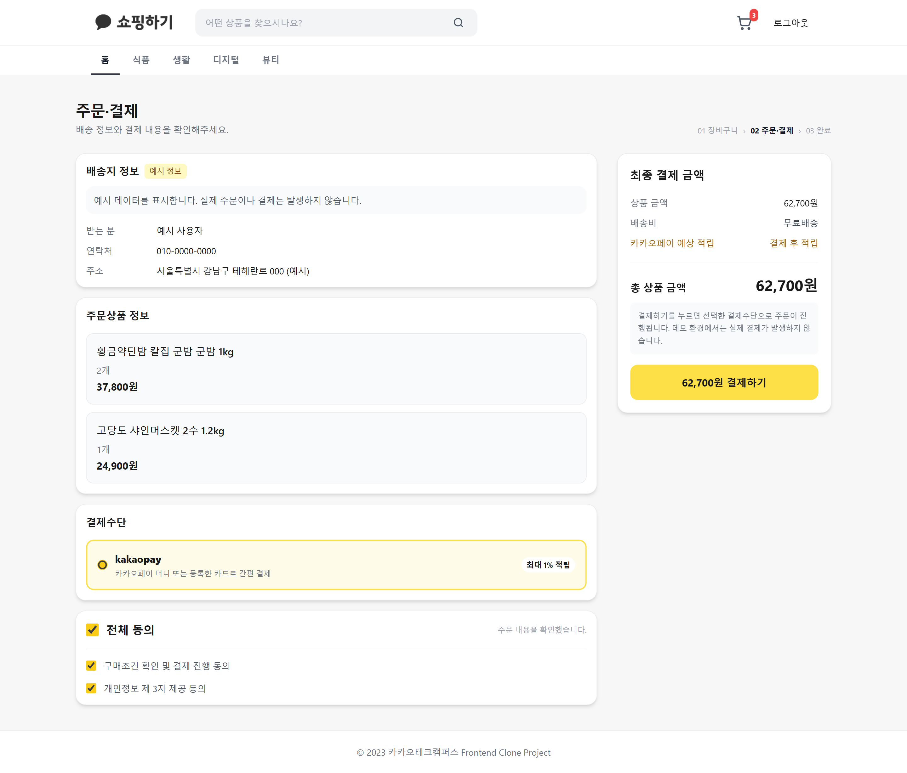
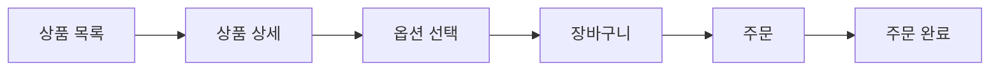
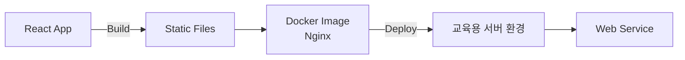

# Kakao Shopping

> **화면·인터페이스 요구사항과 REST API를 기반으로 구현한 React 쇼핑 서비스**

Kakao Tech Campus Frontend 교육 과정에서 진행한 프로젝트로, 제공된 화면 설계와 Backend REST API를 기반으로 **상품 탐색 → 상세 조회 → 장바구니 → 주문 완료**까지의 주요 쇼핑 흐름을 구현했습니다.

주차별 Pull Request와 코드 리뷰를 통해 Component 책임, Client/Server State 분리, 비동기 데이터 처리와 Query Cache 관리 방식을 개선했습니다.

교육 과정 종료 후에는 기존 API 계약을 유지한 **MSW 기반 Mock API 환경**을 추가하여 Backend 없이도 주요 기능을 실행하고 검증할 수 있도록 정비했습니다.

**React · JavaScript · Redux Toolkit · TanStack Query · Axios · Tailwind CSS · MSW**

<table>
  <tr>
    <td align="center">
      
    </td>
    <td align="center">
      
    </td>
  </tr>
  <tr>
    <td align="center"><b>상품 탐색</b></td>
    <td align="center"><b>상품 상세 · 옵션 선택</b></td>
  </tr>
  <tr>
    <td align="center">
      
    </td>
    <td align="center">
      
    </td>
  </tr>
  <tr>
    <td align="center"><b>장바구니</b></td>
    <td align="center"><b>주문</b></td>
  </tr>
</table>

---

## Project Overview

| 항목 | 내용 |
| --- | --- |
| **교육 과정** | Kakao Tech Campus Frontend |
| **개발 영역** | Frontend |
| **주요 기능** | 회원가입·로그인, 상품 조회, 장바구니, 주문 |
| **개발 방식** | 주차별 요구사항 구현 · Pull Request · 코드 리뷰 |
| **API 연동** | Axios · REST API |
| **상태 관리** | Redux Toolkit · TanStack Query |
| **배포 경험** | Docker · Nginx 기반 Frontend 서버 배포 |
| **현재 환경** | Node.js 22 · MSW 기반 독립 실행 및 검증 |

---

## Core User Flow



상품 목록과 상세 페이지는 비로그인 상태에서도 접근할 수 있으며, 장바구니와 주문은 인증이 필요한 Route로 구분했습니다.

---

## Core Implementation

### 1. REST API 기반 Frontend 구현

화면과 인터페이스 요구사항, Backend API 명세를 기반으로 사용자 동작을 실제 API 요청과 연결했습니다.

HTTP 요청은 Component 내부에 직접 작성하지 않고 Service 영역으로 분리하고, 공통 Axios Instance를 통해 인증·상품·장바구니·주문 API를 호출하도록 구성했습니다.

```text
Page / Component
        ↓
Redux Toolkit / TanStack Query
        ↓
Service
        ↓
Axios Instance
        ↓
REST API
```

주요 연동 범위는 다음과 같습니다.

| 영역 | 구현 내용 |
| --- | --- |
| **인증** | 회원가입·로그인 및 인증 상태 유지 |
| **상품** | 상품 목록·상세 조회 및 추가 데이터 로딩 |
| **장바구니** | 상품 추가·조회·수량 변경 |
| **주문** | 주문 생성 및 ID 기반 결과 조회 |

---

### 2. Client State와 Server State 분리

상태의 성격에 따라 관리 책임을 구분했습니다.

- **Redux Toolkit** — 로그인 사용자와 인증 Client State
- **TanStack Query** — 상품·장바구니·주문 Server State
- **localStorage** — 인증 Token persistence
- **React State** — Component 내부 UI State

상품 상세과 주문 결과처럼 Resource 식별자가 필요한 데이터는 다음과 같이 Query Key에 ID를 포함했습니다.

```text
상품 목록   → ["products"]
상품 상세   → ["product", productId]
장바구니    → ["cart"]
주문 결과   → ["order", orderId]
```

이를 통해 Redux와 React Query를 동일한 목적으로 중복 사용하지 않고 **데이터의 소유 주체에 따라 상태 관리 책임을 분리**했습니다.

---

### 3. 비동기 데이터 처리

상품 목록은 `useInfiniteQuery`와 Intersection Observer를 이용해 페이지 단위로 추가 조회했습니다.

비동기 요청 상태도 하나의 Loading 상태로 처리하지 않고 다음과 같이 구분했습니다.

- 최초 조회 → Skeleton UI
- 추가 조회 → Additional Loading
- 검색 결과 없음 → Empty State
- 조회 실패 → Error State
- 마지막 페이지 → 추가 요청 종료

장바구니 수량 변경에는 **Optimistic Update**를 적용하여 서버 응답 전에 Query Cache와 UI를 먼저 갱신했습니다.

요청 실패 시 이전 Cache로 Rollback한 뒤 Query를 재검증하며, 동일 Cart ID에 Mutation이 진행 중인 경우 추가 요청을 제한하여 중복 Mutation을 제어했습니다.

---

### 4. 인증과 Protected Route

인증 상태는 Redux Toolkit으로 관리하고 Token은 `localStorage`를 통해 유지했습니다.

인증이 필요한 기능은 `RequiredAuthLayout`으로 분리하여 Page마다 인증 여부를 반복해서 검사하지 않도록 구성했습니다.

```text
Public
├─ 상품 목록
├─ 상품 상세
├─ 로그인
└─ 회원가입

Protected
├─ 장바구니
├─ 주문
└─ 주문 완료
```

---

## Code Review

교육 과정에서는 주차별 구현 결과를 Pull Request로 제출하고 코드 리뷰를 반영했습니다.

리뷰에서 지적된 문제를 해당 코드만 수정하는 데 그치지 않고 **이후 기능에 적용할 구현 기준으로 확장하는 데 중점**을 두었습니다.

### Authentication State Responsibility

[PR #71](https://github.com/Kakao-tech-campus-FE/step2-FE-kakao-shop/pull/71)

로그인 상태가 Local State와 `localStorage` 등에 분산된 구조를 점검하고, 이후 **Redux Toolkit은 인증 Client State, localStorage는 Token persistence**를 담당하도록 책임을 구분했습니다.

### React Query Cache Identity

[PR #197](https://github.com/Kakao-tech-campus-FE/step2-FE-kakao-shop/pull/197)

상품 상세 조회에서 고정된 Query Key를 사용하던 구현에 대해 상품 ID를 포함해야 한다는 리뷰를 받았습니다.

```jsx
// Before
useQuery("product", () => getProductById(id));

// After
useQuery({
  queryKey: ["product", id],
  queryFn: () => getProductById(id),
});
```

이를 통해 Query Key가 단순 요청 이름이 아니라 **Server State의 Cache Identity**라는 점을 이해하고, 이후 주문 결과에도 `["order", orderId]` 형태로 동일한 기준을 적용했습니다.

---

## Deployment

교육 과정 마지막에는 React Production Build를 **Docker Image로 구성하고 Nginx를 통해 실제 교육용 서버 환경에 배포**했습니다.



당시 사용한 `Dockerfile`, `default.conf`, `goorm.manifest`는 실제 배포 경험을 확인할 수 있도록 Repository에 보존했습니다.

---

## Portfolio Refactoring

교육 과정 종료 후 기존 Backend를 더 이상 사용할 수 없게 되어 **기존 API 계약을 유지한 MSW 기반 Mock API 환경**을 구성했습니다.

```text
React Component
      ↓
TanStack Query
      ↓
Service
      ↓
Axios
      ↓
REST API Request
      ↓
MSW Handler
```

정적 데이터를 Component에 직접 삽입하지 않고 기존 네트워크 요청 구조를 유지하여, Backend가 없는 현재 환경에서도 인증·상품·장바구니·주문의 주요 흐름을 확인할 수 있도록 구성했습니다.

초기 교육 과정에서 제작한 `Breadcrumb`, `Carousel`, `Checklist`, `RadioButton`, `ToggleButton` 등의 Component는 학습 과정 보존을 위해 `components/exercises`로 분리했습니다.

> MSW 환경 구성과 Repository 정리는 교육 당시 구현과 구분되는 **프로젝트 이후 개인 포트폴리오 정비 작업**입니다.

---

## Verification

현재 Repository를 기준으로 테스트, Production Build와 정적 검증을 수행했습니다.

| 검증 | 결과 |
| --- | --- |
| **Test Suites** | 18 passed |
| **Tests** | 72 passed |
| **Production Build** | Passed |
| **ESLint** | Error 0 |
| **`git diff --check`** | Passed |

테스트는 인증, Form Validation, Protected Query, 장바구니 Optimistic Update와 Rollback, 주문 API 계약 등 주요 사용자 흐름과 회귀 가능성이 높은 영역을 중심으로 구성했습니다.

---

## Tech Stack

| 영역 | 기술 |
| --- | --- |
| **Frontend** | React 18 · JavaScript |
| **Routing** | React Router 6 |
| **Client State** | Redux Toolkit |
| **Server State** | TanStack Query |
| **HTTP** | Axios |
| **Styling** | Tailwind CSS · styled-components · CSS |
| **Mock API** | MSW |
| **Testing** | Jest · React Testing Library |
| **Build** | Create React App |
| **Deployment** | Docker · Nginx |

---

## Running Locally

### Requirements

- Node.js `>=22.20.0 <23`
- npm `>=10 <11`

### Run

```bash
npm ci
npm start
```

별도의 Backend 설정 없이 MSW가 `/api` 요청을 Network Layer에서 처리합니다.

### Test & Build

```bash
npm test -- --watchAll=false
npm run build
```

---

## Limitations

이 Repository는 **교육 당시 구현을 보존하면서 현재도 주요 Frontend 흐름을 검증할 수 있도록 정리한 포트폴리오 프로젝트**입니다.

- 현재 API 환경은 종료된 교육 Backend를 대체하는 MSW Mock입니다.
- 주문은 실제 결제가 발생하지 않는 교육용 Flow입니다.
- 상품 상세의 `구매하기`는 교육 당시 구현을 보존하며 실제 Buy Now Flow와 연결되지 않습니다.
- Mock 기반 Cart·Order 상태는 새로고침 시 초기화될 수 있습니다.
- 교육 당시 Docker·Nginx 배포 설정과 현재 Local/MSW 실행 환경은 별도로 관리합니다.

---
