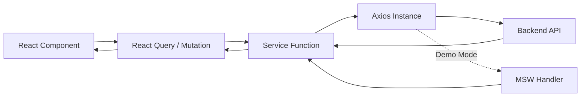
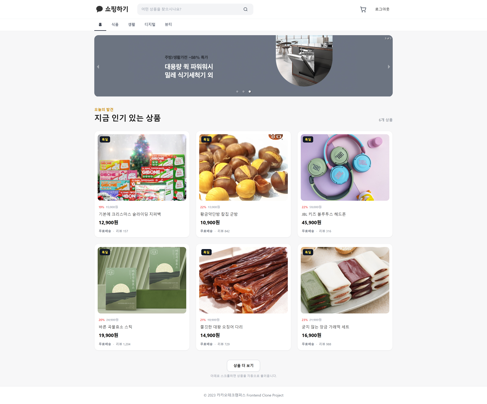
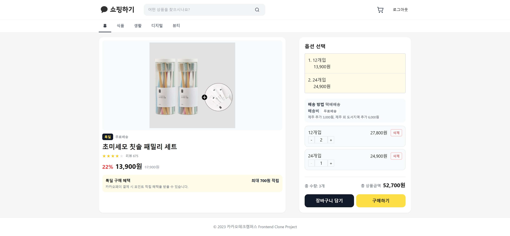
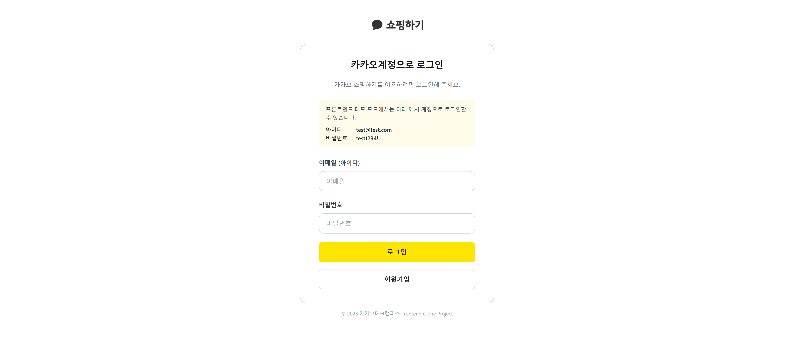
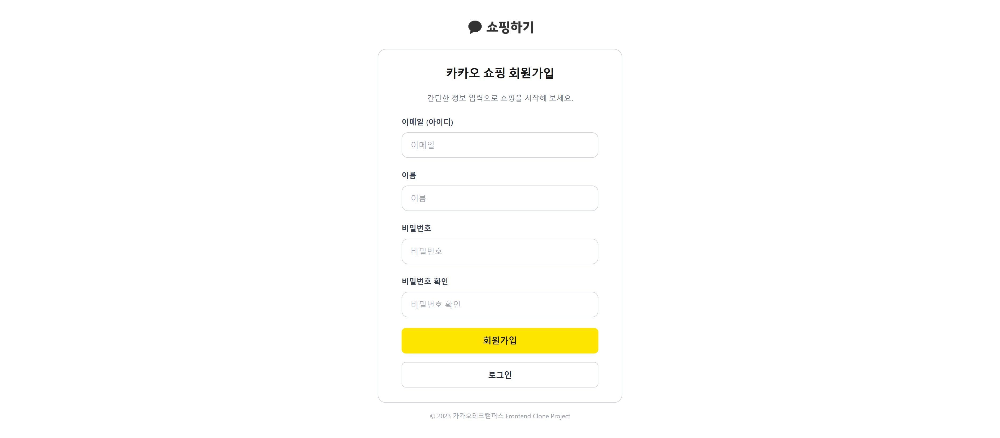
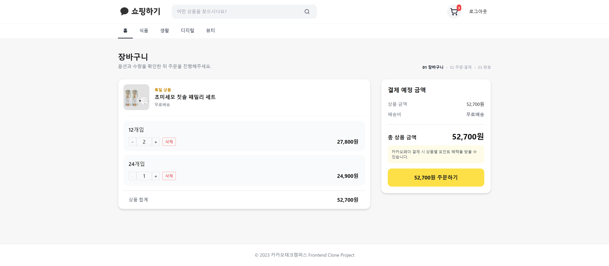
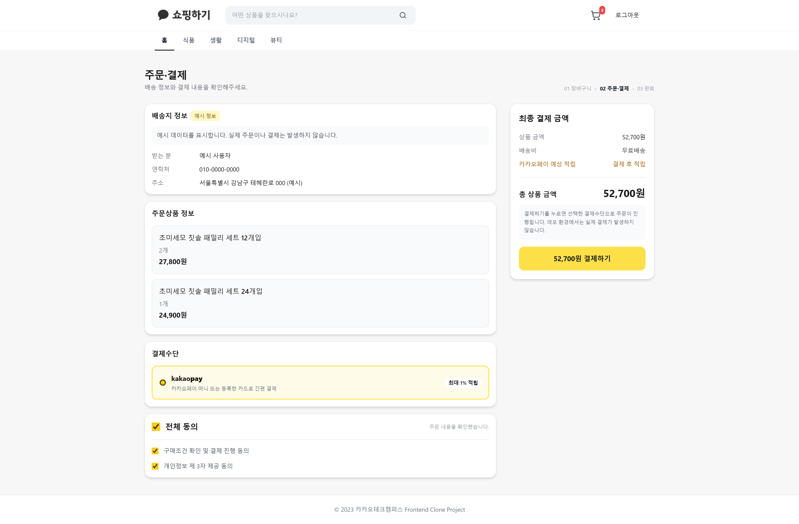
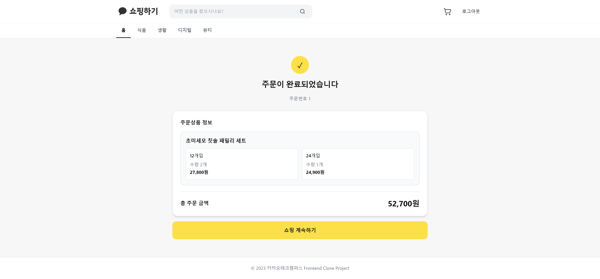

# 카카오테크캠퍼스 2단계 프로젝트 > 카카오 쇼핑하기 

## 프로젝트 소개
상품 탐색부터 장바구니, 주문 완료까지의 쇼핑 흐름을 구현한 React 프로젝트
프론트엔드 학습 목적으로 제작한 클론 프로젝트

- React의 컴포넌트 설계와 상태 관리
- Axios를 통한 백엔드 API 연결
- TanStack React Query를 활용한 서버 상태 관리
- 인증이 필요한 페이지의 라우팅

## 프로젝트 핵심

| 항목 | 내용 |
| --- | --- |
| 담당 영역 | 프론트엔드 |
| 주요 구현 | 인증, 상품 조회, 무한 스크롤, 옵션 선택, 장바구니, 주문 |
| API | 교육 과정에서 제공한 REST API 명세 연동 |
| 데모 환경 | MSW로 동일한 API 요청·응답 흐름 재현 |
| 상태 관리 | Redux Toolkit, TanStack React Query |
| 테스트 | Jest, React Testing Library |

## 기술 스택

| 구분 | 기술 |
| --- | --- |
| Frontend | React 18, JavaScript |
| Routing | React Router 6 |
| Client State | Redux Toolkit, React Redux |
| Server State | TanStack React Query 4 |
| HTTP | Axios |
| Mock API | MSW 2 |
| Styling | Tailwind CSS, styled-components, CSS |
| Test | Jest, React Testing Library |
| Build | Create React App 5 |

## React로 구현하며 학습한 내용

### 1. 컴포넌트 기반 UI 설계

- 화면을 `atoms`, `molecules`, `organisms`, `templates`, `pages` 단위로 분리했습니다.
- 버튼, 입력창, 상품 카드처럼 반복되는 UI를 공통 컴포넌트로 구성했습니다.
- 상품 목록, 상세, 장바구니, 주문 화면을 데이터와 UI 역할에 따라 나눴습니다.
- props를 통해 공통 컴포넌트의 스타일과 동작을 확장할 수 있도록 설계했습니다.

### 2. React Hooks를 이용한 상태와 사용자 입력 관리

- `useState`로 폼 입력값, 검증 결과, 옵션 수량과 요청 상태를 관리했습니다.
- 공통 입력 로직을 `useInput` Hook으로 분리했습니다.
- `useEffect`를 이용해 무한 스크롤 요청과 화면 상태 변화를 처리했습니다.
- 요청 중 버튼 비활성화와 중복 제출 방지 로직을 적용했습니다.

### 3. 클라이언트 상태와 서버 상태 분리

- 로그인 토큰처럼 애플리케이션 전역에서 사용하는 상태는 Redux Toolkit으로 관리했습니다.
- 상품, 장바구니, 주문처럼 API에서 가져오는 데이터는 React Query로 관리했습니다.
- Query key를 기능별로 정의해 캐시 식별 방식을 통일했습니다.
- mutation 성공 후 장바구니 데이터를 갱신해 서버 응답과 화면 상태를 동기화했습니다.

### 4. React Router를 이용한 사용자 흐름 구성

- 상품 ID와 주문 ID를 URL parameter로 전달해 상세 화면을 구성했습니다.
- 인증 여부를 확인하는 `RequiredAuthLayout`으로 장바구니와 주문 경로를 보호했습니다.
- 로그인, 회원가입, 로그아웃 완료 상태는 navigation state로 전달해 토스트를 한 번만 표시했습니다.
- 검색어와 카테고리는 query string으로 관리해 URL과 화면 상태를 연결했습니다.

### 5. 무한 스크롤과 비동기 화면 상태

- `useInfiniteQuery`로 페이지별 상품 데이터를 누적했습니다.
- Intersection Observer가 화면 하단을 감지하면 다음 페이지를 요청하도록 구현했습니다.
- 로딩, 추가 로딩, 빈 결과, 일부 페이지 요청 실패 상태를 각각 구분해 표시했습니다.
- 검색 중에는 필요한 페이지를 추가 조회한 후 프론트엔드에서 결과를 필터링합니다.

## API 연동 구조



### Axios 공통 설정

- `/api`를 기준으로 공통 Axios instance를 생성했습니다.
- 요청 interceptor에서 저장된 인증 토큰을 Authorization header에 추가합니다.
- 모든 요청에 timeout과 JSON content type을 공통 적용했습니다.

### Service 계층

컴포넌트에서 Axios를 직접 호출하지 않고 기능별 service 함수로 분리했습니다.

```text
services
├── index.js       # Axios instance와 interceptor
├── product.js     # 상품 목록·상세 조회
├── user.js        # 로그인·회원가입
├── cart.js        # 장바구니 조회·추가·수정
└── order.js       # 주문 생성·결과 조회
```

API의 중첩된 응답은 service 계층에서 필요한 데이터만 반환하도록 정리해 컴포넌트가 HTTP 응답 구조에 직접 의존하지 않게 했습니다.

### React Query 적용

- `useQuery`: 상품 상세, 장바구니, 주문 결과 조회
- `useInfiniteQuery`: 페이지 단위 상품 목록 조회
- `useMutation`: 장바구니 추가·수정과 주문 생성
- 캐시 갱신: mutation 성공 후 관련 Query 데이터를 갱신

### 인증과 오류 처리

- 로그인과 회원가입 응답의 토큰을 Redux와 localStorage에 저장합니다.
- Axios interceptor가 인증이 필요한 API 요청에 토큰을 자동으로 포함합니다.
- 토큰 만료, 네트워크 오류, 404와 업무 오류를 공통 오류 Hook에서 구분합니다.
- 폼과 요청 오류는 주로 화면의 `role="alert"` 영역에 표시하고, 공통 인증 오류 등 일부 상황은 브라우저 alert로 안내합니다.

### MSW 데모 API

백엔드 없이도 전체 사용자 흐름을 확인할 수 있도록 실제 API 계약과 같은 endpoint와 응답 형식을 MSW로 재현했습니다.

- 상품 목록과 상세 조회
- 로그인과 회원가입
- 장바구니 조회, 추가, 수량 변경
- 주문 생성과 주문 결과 조회
- 400, 401, 404 오류 응답

## 주요 기능

- 회원가입 후 자동 로그인 및 완료 토스트
- 로그인, 로그아웃과 인증 상태 유지
- 상품 검색과 카테고리 필터
- 상품 목록 무한 스크롤
- 상품 상세 정보와 옵션 선택
- 옵션별 수량 변경 및 합계 계산
- 장바구니 추가와 바로 구매
- 장바구니 수량 변경과 상품 삭제
- 주문 정보 확인과 결제 동의
- 주문 생성과 주문 완료 결과 조회
- 반응형 레이아웃과 키보드 focus 지원

## 화면 구성

### 1. 메인 페이지



- 배너와 전체 상품 목록을 표시합니다.
- 검색어와 카테고리를 URL query string으로 관리합니다.
- 화면 하단 감지 시 다음 상품 페이지를 불러오는 무한 스크롤을 제공합니다.
- 로딩 중에는 상품 카드 skeleton을 표시합니다.

### 2. 상품 상세 페이지



- URL의 상품 ID를 이용해 상세 API를 요청합니다.
- 상품 옵션을 선택하고 옵션별 수량을 조절할 수 있습니다.
- 선택한 옵션의 합계 금액을 실시간으로 계산합니다.
- 장바구니 담기와 바로 구매 요청을 구분해 처리합니다.

### 3. 로그인 페이지



- 제어 컴포넌트 방식으로 이메일과 비밀번호를 관리합니다.
- 입력값 검증 후 로그인 API를 요청합니다.
- 로그인 성공 시 토큰을 저장하고 메인 페이지에 완료 토스트를 표시합니다.
- 데모 모드에서는 화면에 표시된 예시 계정으로 로그인할 수 있습니다.

### 4. 회원가입 페이지



- 이메일, 이름, 비밀번호와 비밀번호 확인 값을 검증합니다.
- Enter 제출과 버튼 제출을 동일한 form submit 흐름으로 처리합니다.
- 중복 요청을 방지하고 API 오류 메시지를 입력 폼 안에 표시합니다.
- 가입 성공 후 인증 상태를 저장하고 완료 토스트를 표시합니다.

### 5. 장바구니 페이지



- 인증된 사용자의 장바구니 데이터를 조회합니다.
- 상품 옵션별 수량 변경과 삭제를 지원합니다.
- 상품 금액과 결제 예정 금액을 순수 계산 함수로 산출합니다.
- 변경 완료 후 React Query 캐시와 화면을 동기화합니다.

### 6. 주문·결제 페이지



- 주문 상품과 최종 결제 금액을 확인할 수 있습니다.
- 필수 결제 동의를 완료한 경우에만 주문 API를 요청합니다.
- 요청 중 결제 버튼을 비활성화해 중복 주문을 방지합니다.
- 배송지와 결제 수단은 UI 확인을 위한 예시 정보입니다.

### 7. 주문 완료 페이지



- 주문 API가 반환한 ID로 주문 결과를 조회합니다.
- 주문 번호, 주문 상품과 총 주문 금액을 표시합니다.
- API 응답에 상품 이미지가 없어 텍스트 중심의 주문 내역으로 구성했습니다.

## 프로젝트 구조

```text
src
├── components      # 공통 UI와 화면 단위 컴포넌트
├── hooks           # 입력 및 API 오류 처리 Hook
├── mocks           # MSW handler와 데모 상태
├── pages           # Route와 연결되는 페이지
├── services        # Axios와 기능별 API 함수
├── store           # Redux 인증 상태
├── styles          # 공통 CSS
└── utils           # 검증, 토큰, 금액 계산 로직
```

## 실행 방법

### 권장 환경

- Node.js `22.20.0`
- npm `10.x`

### 설치 및 실행

```bash
npm ci
```

개발 서버를 실행합니다.

```bash
npm start
```

브라우저에서 `http://localhost:3000`으로 접속합니다.

별도의 환경변수 설정 없이 MSW 데모 API가 기본으로 실행됩니다.

### 데모 로그인

```text
아이디: test@test.com
비밀번호: test1234!
```

## 테스트와 빌드

```bash
npm test -- --watchAll=false
npm run build
```

현재 기준 15개 테스트 스위트, 57개 테스트가 통과합니다.

주요 테스트 범위:

- 로그인과 회원가입 입력 검증 및 제출
- 인증 토큰 저장, 만료와 로그아웃
- API endpoint, payload와 응답 변환
- 상품 옵션 선택, 수량 변경과 바로 구매
- 장바구니 합계 계산과 상태 변경
- 주문 동의, 주문 생성과 완료 화면 이동
- MSW 장바구니·주문 상태
- 공통 로딩·오류 UI

## 개선 사항

- API 호출과 인증 token 처리를 공통 모듈로 통합
- React Query key와 cache 갱신 방식 정리
- 장바구니 계산과 폼 검증 로직을 순수 함수로 분리
- 중복 요청 방지와 화면 내 오류 메시지 적용
- 상품 목록부터 주문 완료까지 반응형 UI 개선
- MSW 기반 로컬 데모 API 구성
- 사용자 흐름 중심의 테스트 추가

## 참고

- 실제 결제나 주문은 발생하지 않습니다.
- 기존 교육 API 대신 로컬 데모에서는 MSW를 사용합니다.
- CRA 5 구조를 유지했으며, 장기적으로는 Vite 전환을 고려할 수 있습니다.
- `npm audit` 결과에는 CRA 5 기반 과거 교육 프로젝트의 전이 dependency 보안 부채가 포함되어 있으며, 이 저장소는 운영 배포용 프로젝트가 아닙니다.
